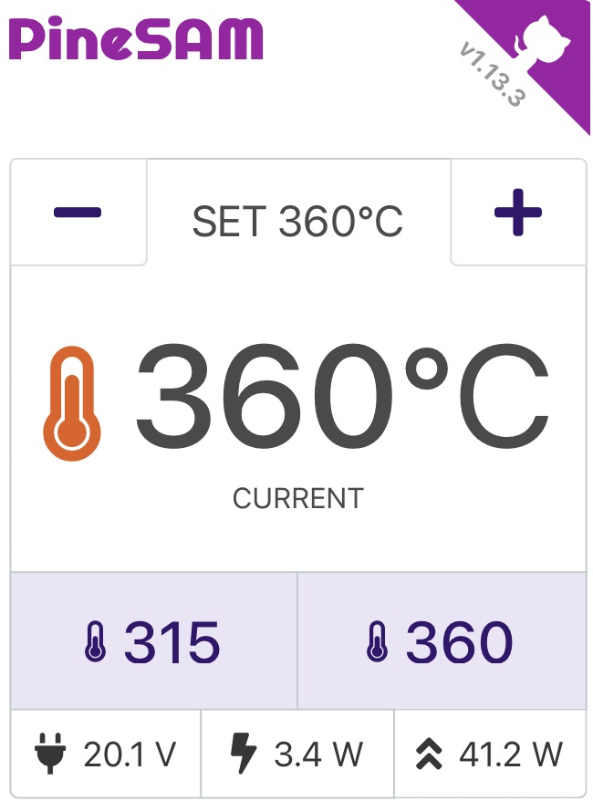

## Pinecil Settings and Menus

{ align=right width=350 style="margin-top: -1rem" float="left" }

Why focus on soldering when you can play with the settings instead? With this app you have full control over your new shiny Pinecil V2 from your computer using bluetooth.

**NB**: No special browser BLE GATT or flags required and works on all major OS/devices.

**NB**: This app needs the python backend to run on a computer, it CANNOT run entirely in the browser like Joric's UI.
<div style="clear: right;"></div>

<details markdown>
  <summary>
    Full settings view
  </summary>
  
</details>

<div style="clear: both;"></div>

## Features

-  Automatically detect Pinecil V2 over BLE.
- Control all settings on the device.
-  Save to Flash: toggle to save changes directly onto Pinecil (leave off unless actively changing settings).
-  Work HUD main screen with: Set °C/°F `[+][-]` buttons, live tip °C/°F updates, peak watts, live watts, input voltage.
-  Preset buttons to allow quick change of user defined temperatures (PineSAM extra feature not available directly inside Pinecil).
-  Backend runs locally on all major platforms/OS while the user interface runs on your favorite browser.

## Platforms
 | System  | MacOS   | Linux  | Windows | iOS   | Android|
 | :-----: | :-----: | :----: | :-----: | :---: | :----: |
 | UI      |:heavy_check_mark:|:heavy_check_mark:|:heavy_check_mark:|:heavy_check_mark:|:heavy_check_mark:|
 | backend |:heavy_check_mark:|:heavy_check_mark:|:heavy_check_mark:|       |         |


## :signal_strength: Remote access

You can access the settings remotely once the app is running on the main PC/laptop.

* Find the [local IP address](https://lifehacker.com/how-to-find-your-local-and-external-ip-address-5833108) of the device running the app.
* open `http://<ip-address>:8080/` on the second device on the same network (e.g., a phone).
* Pinecil needs to be within BLE range of the computer running the PineSAM app.


## :abacus: Contributors Welcome

Please fork the repo, and submit Pull Requests using the `/dev` branch.


## Running Unit tests

```shell
# run inside 'backend' directory:
pipenv run test
```

## :book: References

- [Pinecil](https://wiki.pine64.org/wiki/Pinecil) - The Pinecil Wiki page
- [IronOS](https://github.com/Ralim/IronOS) - The OS running on this soldering iron
- [Pinecil Web UI](https://github.com/joric/pinecil) - A neat web-based UI, requires bluetooth browser support
- [Pinecil Authenticity Checker](https://pinecil.pine64.org/) - almost all AliExpress Pinecils are fake, check your V2!

