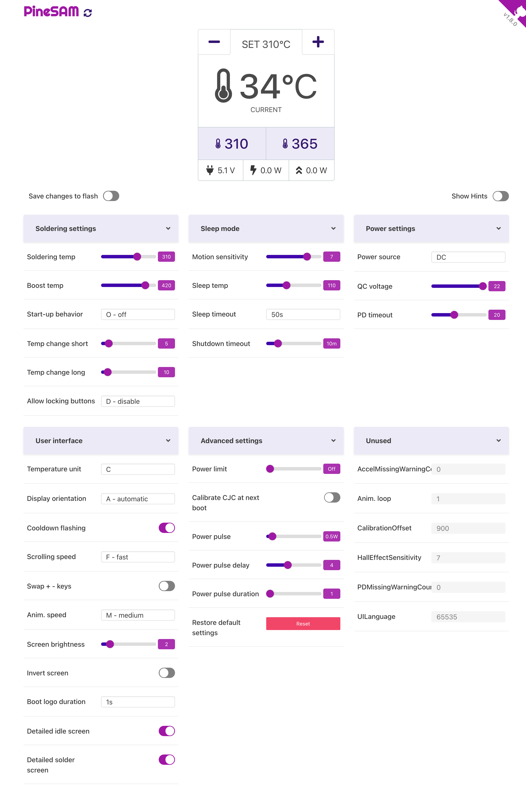

# User Guide

1. Click on PineSAM logo to reveal the unique BLE name of your Pinecil.
2. Update available notice appears under the PineSAM logo if a new release is available for download.
3. PineSAM version number is next to the Github Cat in the top right of the screen.
4. Clicking on the waving cat links to the main Github PineSAM repo.
6. Temperature automatically adjusts based on °C or °F setting.
7. Colors are designed to work in Light or Dark view mode on PC and Phone Browsers.
8. Thermostat icon changes into 100 different color hues as the live temperature changes.

## Show Hints

Toggles on/off to display help messages from Pinecil and PineSAM.

## Save to Flash

- This should be `Off` most of the time. Not needed if actively soldering and using the Work HUD to change temperature (preserves flash cycles).
- Toggle this `On` only before changing settings and if you want the settings to persist on Pinecil reboot. This saves/flashes to the BL706 MCU chip.

## Change Settings

1. Toggle `On` the [Save to Flash]
2. Change multiple settings and when done, toggle `Off` the [Save to Flash].
3. While actively soldering and using buttons in the Work HUD, it is best to leave this off. No reason to constantly flash to pinecil for each temperature change (don't worry, Pinecil still changes temperature, it's just not permanently flashed and saved on Pinecil).

## Work HUD

{ align="left" width="400" style="margin-top: -1rem" float="left" }

1. This is a HUD window designed as an all-in-one single view that can be used during soldering.
2. Phone: designed to be completely viewable on vertical screen.
3. In this view one can control Set temperature with buttons ++plus++ ++minus++ and view important stats, e.g., live temperature.
4. Power Bar: bottom bar shows the input voltage, the current estimated watts pinecil is drawing, and the highest peak watt hit during the session.
5. It is best to leave save to flash toggle Off while using the Work HUD to save on pinecil flash cycles as the PineSAM buttons are used often during a soldering session.

### Preset buttons

1. Allows quick change of user customizable temperatures (exclusive to PineSAM and not available on Pinecil iron directly).
2. Preset buttons can be customized and saved instantly to desired temperature.
3. Presets are stored in the browser's [LocalStorage](https://developer.mozilla.org/en-US/docs/Web/API/Window/localStorage) and will persist if the same browser and device are used again.

### Preset Save

1. Set the number desired with the PineSAM ++plus++ ++minus++ buttons.
2. Then long hold the Preset 1 or 2 you want to save to, click OK on the confirmation box.
3. Whatever is shown iat the top in the Set °C will be saved to the Preset button held down.

# Settings Categories

- For familiarity, Settings are grouped in a similar way as seen on Pinecil (and as organized in Ralim's IronOS firmware).
- Categories can be clicked to collapse and reduce screen clutter.
- Setting numbers can be changed two ways: moving the slider or simply typing on the box next to the slider.
- Drop-down menus are used for clarity of text choices.
- Toggle choices are used for any check boxes  seen on the pinecil (e.g. detailed idle).
- Settings functions are listed [Ralim's IronOS here](https://ralim.github.io/IronOS/Settings/).
 

Full settings view

